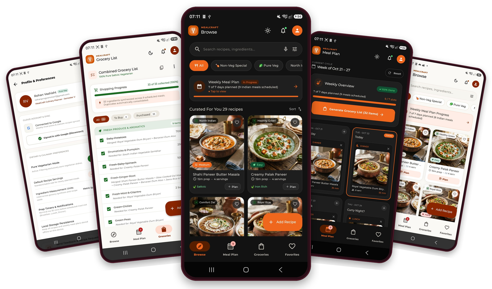
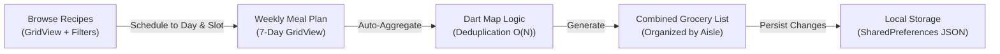
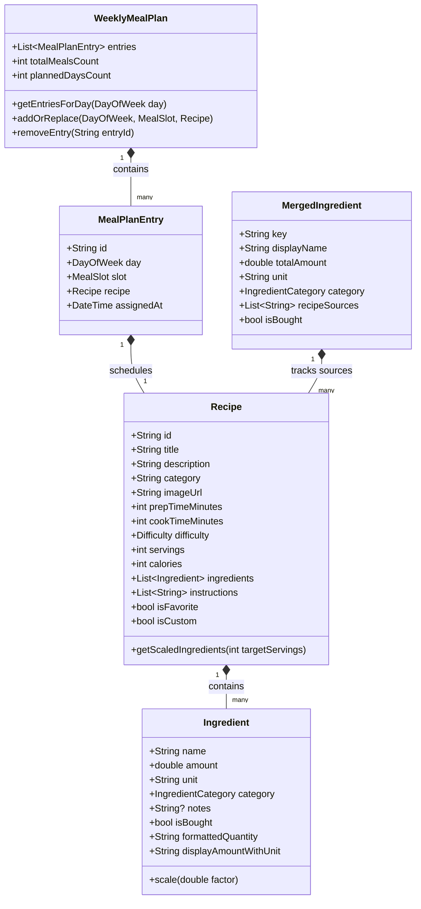

# MealCraft 🍳 — Recipe Sharing & Meal Planner App

<p align="center">
  
</p>

> **Course**: B.Tech Computer Science Engineering (Semester V)  
> **Subject**: Cross Platform Application Development  
> **Case Study**: 40. MealCraft (Recipe Sharing & Meal Planner App)  
> **Framework**: Flutter 3.47+ / Dart 3.13+ (Material 3)  
> **Live Web App**: [rohan-cross-platform.vercel.app](https://rohan-cross-platform.vercel.app/)  
> **GitHub**: [rohanvashisht1234/cross_platform_app_development](https://github.com/rohanvashisht1234/cross_platform_app_development)  

---

## 📑 Table of Contents
1. [Project Overview & Problem Statement](#1-project-overview--problem-statement)
2. [Deliverables Checklist](#2-deliverables-checklist)
3. [Architecture & Data Models](#3-architecture--data-models)
4. [Dart Logic: Map-Based Ingredient Merging](#4-dart-logic-map-based-ingredient-merging)
5. [UI / Widgets Implementation](#5-ui--widgets-implementation)
6. [Appetizing Material 3 Theming](#6-appetizing-material-3-theming)
7. [Figma Guided Flow & Progress Cues](#7-figma-guided-flow--progress-cues)
8. [Local Storage Persistence](#8-local-storage-persistence)
9. [Academic Justifications (With Proper Justification)](#9-academic-justifications)
10. [Testing & Verification](#10-testing--verification)
11. [How to Run](#11-how-to-run)

---

## 1. Project Overview & Problem Statement

MealCraft addresses everyday cognitive fatigue in meal planning and grocery shopping. Users browse rich culinary recipes, schedule dishes across a 7-day calendar, and automatically generate a deduplicated, supermarket-aisle organized grocery shopping list. All data is persisted locally on the device.



---

## 2. Deliverables Checklist

| Requirement / Deliverable | Status | File Implementation |
|---|---|---|
| **Figma Design Flow** | ✅ Complete | [`figma_design/FIGMA_DESIGN_SPECIFICATIONS.md`](figma_design/FIGMA_DESIGN_SPECIFICATIONS.md) + [`figma_design/mealcraft_interactive_prototype.html`](figma_design/mealcraft_interactive_prototype.html) |
| **Recipe Browse Screen** | ✅ Complete | [`lib/screens/recipe_browse_screen.dart`](lib/screens/recipe_browse_screen.dart) with `GridView` & `Card` |
| **Recipe Detail Screen** | ✅ Complete | [`lib/screens/recipe_detail_screen.dart`](lib/screens/recipe_detail_screen.dart) with servings scaling & checkable `ListView` |
| **Weekly Meal Plan Screen**| ✅ Complete | [`lib/screens/weekly_meal_plan_screen.dart`](lib/screens/weekly_meal_plan_screen.dart) with day-by-day `GridView` |
| **Appetizing Material 3 Theme** | ✅ Complete | [`lib/theme/app_theme.dart`](lib/theme/app_theme.dart) (Terracotta, Sage, Amber, Linen Cream) |
| **Dart Logic (Map Merging)** | ✅ Complete | [`lib/services/ingredient_merger.dart`](lib/services/ingredient_merger.dart) |
| **Local Storage Persistence** | ✅ Complete | [`lib/services/storage_service.dart`](lib/services/storage_service.dart) via `SharedPreferences` |
| **Unit & Widget Tests** | ✅ Complete | 7 passing tests in [`test/`](test/) |

---

## 3. Architecture & Data Models

### Class Diagram


---

## 4. Dart Logic: Map-Based Ingredient Merging

### Core Algorithm (`lib/services/ingredient_merger.dart`)
When users schedule multiple recipes (e.g. *Royal Shahi Paneer Makhani* on Monday and *Homestyle Palak Paneer* on Tuesday), both call for **Paneer**, **Butter**, and **Fresh Ginger**. Instead of listing duplicate items, the engine consolidates them into a single entry:

```dart
class IngredientMerger {
  static List<MergedIngredient> mergeRecipes(List<Recipe> recipes) {
    // Dart Map key: normalized_name + '___' + normalized_unit
    final Map<String, _Accumulator> map = {};

    for (final recipe in recipes) {
      for (final ingredient in recipe.ingredients) {
        final normalizedName = _normalizeName(ingredient.name);
        final normalizedUnit = _normalizeUnit(ingredient.unit);
        final key = '${normalizedName}___$normalizedUnit';

        if (map.containsKey(key)) {
          // Accumulate amount and preserve source recipe title
          final existing = map[key]!;
          existing.totalAmount += ingredient.amount;
          if (!existing.sources.contains(recipe.title)) {
            existing.sources.add(recipe.title);
          }
        } else {
          // Initialize new map entry
          map[key] = _Accumulator(
            key: key,
            displayName: _capitalize(ingredient.name.trim()),
            totalAmount: ingredient.amount,
            unit: normalizedUnit,
            category: ingredient.category,
            sources: [recipe.title],
          );
        }
      }
    }

    return map.values.map((acc) => MergedIngredient(...)).toList();
  }
}
```

### Algorithmic Complexity
- **Time Complexity**: $\mathcal{O}(N)$ where $N$ is the total count of ingredients across all recipes.
- **Space Complexity**: $\mathcal{O}(U)$ where $U$ is the number of distinct ingredients ($U \le N$).

---

## 5. UI / Widgets Implementation

### 1. `GridView` Usage
- **Recipe Browse Screen**: A 2-column responsive `GridView.builder` (`childAspectRatio: 0.72`) displays recipe cards with photo, prep time, difficulty badge, and planning actions.
- **Weekly Meal Plan Screen**: A 7-day `GridView.builder` (`childAspectRatio: 0.95`) renders each day of the week (Monday through Sunday) as an independent card with meal slot pills and quick deletion.

### 2. `Card` Usage
- **`RecipeCard`**: Material 3 surface with 18px rounded squircle corners, anti-aliased clip, category pill, favorite icon, and high-contrast typography.
- **`DayPlanCard`**: Outlined card highlighting today's date (`TODAY` badge in primary terracotta) and scheduled meals.

### 3. `ListView` Usage
- **Horizontal Category Selector**: Horizontal `ListView.separated` for one-tap cuisine filtering.
- **Recipe Detail Ingredients**: Virtualized `ListView.separated` with checkable items.
- **Cooking Instructions**: Step-by-step numbered `ListView` with completion strikethrough.
- **Grocery Aisles**: Categorized `ListView.builder` grouping items by supermarket aisle (`Fresh Produce & Greens`, `Dairy & Plant-Based`, `Plant Proteins & Tofu`, `Pantry Staples`, etc.).

---

## 6. Appetizing Material 3 Theming

The color palette was chosen based on **culinary psychology**:
- **Primary Terracotta (`#D35400`)**: Evokes roasted earthenware, warmth, and appetite.
- **Herb Sage Green (`#2E7D32`)**: Symbolizes fresh organic produce and checkmark completion.
- **Honey Amber (`#F39C12`)**: Represents golden crusts and active timers.
- **Linen Cream Background (`#FDFBF7`)**: Soft, non-glare surface that reduces eye fatigue when cooking in the kitchen.
- **Dark Mode Support**: Seamless toggle to rich cocoa slate (`#141211`) with warm pastel highlights.

---

## 7. Figma Guided Flow & Progress Cues

Every screen features continuous **progress cues**:
1. **Browse Screen**: Header banner shows planned days counter (*"Weekly Meal Plan: 4 of 7 days planned"*).
2. **Recipe Detail**: Servings Scaler dynamically recalculates quantities; checkable steps track cooking completion; cooking timer provides live countdown.
3. **Weekly Plan Grid**: Visual indicators for completed vs. empty days (*"+ Tap to assign"*).
4. **Grocery List**: Real-time progress bar (*"8 of 14 items collected (57%)"*).

> An interactive visual simulation is included in [`figma_design/mealcraft_interactive_prototype.html`](figma_design/mealcraft_interactive_prototype.html).

---

## 8. Local Storage Persistence

All data is stored on-device using `SharedPreferences`:
- `mealcraft_recipes_v1`: JSON string array of recipes (custom recipes + default presets).
- `mealcraft_weekly_plan_v1`: JSON map of scheduled `MealPlanEntry` items.
- `mealcraft_checked_ingredients_v1`: Set of checked grocery keys.

---

## 9. Academic Justifications

### UI/Widgets Choice Justification
- **`GridView`**: Allows users to scan recipes and days side-by-side without endless vertical scrolling.
- **`Card`**: Creates clear visual boundaries and tactile touch targets compliant with Material 3.
- **`ListView`**: Efficient memory management via view recycling for large ingredient checklists.

### Dart Logic Choice Justification
- **`Map<String, _Accumulator>`**: Prevents $\mathcal{O}(N^2)$ brute-force comparisons, achieving $\mathcal{O}(N)$ linear efficiency and constant $\mathcal{O}(1)$ key lookup.
- **Traceability**: Retaining `recipeSources` provides full transparency so users understand why each ingredient quantity appears on their grocery list.

---

## 10. Testing & Verification

Comprehensive test suites are located in `test/`:
- `test/ingredient_merger_test.dart`: Validates ingredient deduplication, source tracking, aisle grouping, and servings scaling.
- `test/weekly_meal_plan_test.dart`: Validates meal additions, replacements, day clearing, and JSON serialization.
- `test/widget_test.dart`: End-to-end smoke test validating app rendering and tab navigation.

Run tests via:
```bash
flutter test
```
Result: **All 7 tests passed (0 issues).**

---

## 11. How to Run

### Run on macOS Desktop:
```bash
flutter run -d macos
```

### Run on Chrome (Web):
```bash
flutter run -d chrome
```

### View Interactive Figma Prototype:
Open [`figma_design/mealcraft_interactive_prototype.html`](figma_design/mealcraft_interactive_prototype.html) directly in any web browser.

