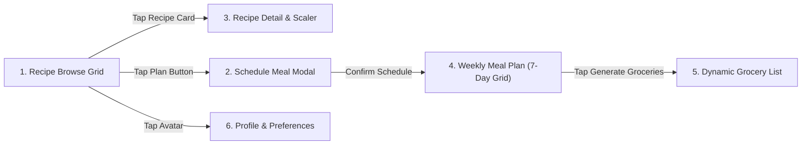

# Figma AI & LLM Blueprint: MealCraft Mobile App Design System

> **Document Purpose**: This comprehensive specification is designed for Figma AI, LLM prompt engineering, and UI code-generation tools to recreate an **exact, pixel-perfect, 1:1 replica** of the MealCraft mobile application in both **Light Mode** and **Dark Mode**.
> 
> **Culinary Framework**: 100% Pure Sattvic Vegetarian (strictly **Zero Meat, No Poultry, No Fish, No Eggs, and Zero Alliums**).
> **Typography Aesthetic**: Geometric Grotesque matching **Proxima Nova** (the signature typeface of Swiggy and premier food delivery systems) paired with Google Fonts **Montserrat / Plus Jakarta Sans**.
> **Contrast Benchmark**: WCAG AAA compliance across all backgrounds. Never use faint low-opacity text on light or dark surfaces.

---

## 1. Global Design Tokens & Variables

### 1.1 Color Palettes

#### Light Mode Tokens (`figmaCreamBg` Hearth Theme)
| Token Name | Hex Code | Figma Variable Type | Usage / Semantics |
|---|---|---|---|
| `sys/light/bg` | `#FBF9F5` | Color | Main scaffold background (warm culinary cream) |
| `sys/light/surface` | `#FFFFFF` | Color | Elevated card backgrounds, dialogs, bottom sheets |
| `sys/light/surface-container` | `#F5F3EF` | Color | Search pill, metric cards, secondary containers |
| `sys/light/border` | `#E5E0D8` | Color | Card strokes, input dividers (1.0px - 1.2px) |
| `sys/light/border-subtle` | `#EFECE6` | Color | Inner tile dividers, subtle outlines |
| `sys/light/primary` | `#8B2500` | Color | Primary brand terracotta, key action buttons, bold titles |
| `sys/light/primary-container` | `#FFDBCD` | Color | Navigation indicators, active day pills |
| `sys/light/primary-soft` | `#FFEDE6` | Color | Plan button backgrounds, light callouts |
| `sys/light/secondary` | `#155A1D` | Color | Sage herb green, shopping progress, vegetarian dots |
| `sys/light/secondary-container`| `#D1E7DD` | Color | "Pure Vegetarian" badge backgrounds |
| `sys/light/text-primary` | `#141311` | Color | Highest contrast text (headings, dish titles, numbers) |
| `sys/light/text-secondary` | `#2E2A25` | Color | High legibility text (prep time, servings, categories) |
| `sys/light/text-muted` | `#4A433D` | Color | Subtitles, ingredient source details (7.8:1 contrast) |
| `sys/light/text-placeholder` | `#6B635A` | Color | Search hint, input placeholders (passes WCAG AA) |

#### Dark Mode Tokens (`figmaDarkBg` Charcoal OLED Theme)
| Token Name | Hex Code | Figma Variable Type | Usage / Semantics |
|---|---|---|---|
| `sys/dark/bg` | `#121212` | Color | OLED deep charcoal black canvas |
| `sys/dark/surface` | `#1E1E1E` | Color | Cards, bottom navigation, top app bar |
| `sys/dark/surface-container` | `#282828` | Color | Metric boxes, button containers, category chips |
| `sys/dark/border` | `#383533` | Color | Distinct card outlines, stroke borders |
| `sys/dark/border-subtle` | `#2A2A2A` | Color | Subtle dividers, tile borders |
| `sys/dark/primary` | `#EE671C` | Color | Radiant terracotta orange, primary actions |
| `sys/dark/primary-container` | `#421D09` | Color | Badge containers, active day backgrounds |
| `sys/dark/secondary` | `#75E59B` | Color | Vibrant mint green, progress indicators, tags |
| `sys/dark/secondary-container`| `#0F5132` | Color | Status pill backgrounds |
| `sys/dark/text-primary` | `#FFFFFF` | Color | Crisp pure white text (16:1 contrast) |
| `sys/dark/text-secondary` | `#F7F5F0` | Color | Clean off-white text (subheadings, active titles) |
| `sys/dark/text-muted` | `#DDD9D2` | Color | Secondary text, prep metadata (9.5:1 contrast) |
| `sys/dark/text-tertiary` | `#C8C4BC` | Color | Explanatory captions, ingredients (7:1 contrast) |
| `sys/dark/text-placeholder` | `#A8A39D` | Color | Search hint, placeholder inputs (5.5:1 contrast) |

---

### 1.2 Typography System (Proxima Nova / Montserrat Aesthetic)

*Font Family:* **Proxima Nova** (Adobe Fonts) or **Montserrat** (Google Fonts).

| Style Name | Size | Line Height | Weight | Letter Spacing | Case | Figma Text Style |
|---|---|---|---|---|---|---|
| `Display/Large` | 32px | 38px | ExtraBold (800) | -0.5px | Title | `Display/L` |
| `Display/Medium`| 28px | 34px | ExtraBold (800) | -0.4px | Title | `Display/M` |
| `Headline/Large`| 22px | 28px | ExtraBold (800) | -0.3px | Title | `Headline/L` |
| `Headline/Medium`| 20px | 26px | ExtraBold (800) | -0.2px | Title | `Headline/M` |
| `Headline/Small`| 18px | 24px | ExtraBold (800) | -0.2px | Title | `Headline/S` |
| `Title/Large` | 16px | 22px | ExtraBold (800) | -0.1px | Normal | `Title/L` |
| `Title/Medium` | 14px | 20px | Bold (700) | 0.0px | Normal | `Title/M` |
| `Title/Small` | 13px | 18px | Bold (700) | 0.1px | Normal | `Title/S` |
| `Body/Large` | 14px | 20px | Medium (500) | 0.0px | Normal | `Body/L` |
| `Body/Medium` | 13px | 19px | Medium (500) | 0.0px | Normal | `Body/M` |
| `Body/Small` | 11.5px| 16px | SemiBold (600) | 0.1px | Normal | `Body/S` |
| `Badge/Caps` | 9.5px | 13px | ExtraBold (800) | 0.6px | Uppercase | `Badge/Caps` |
| `Button/Action` | 13.5px| 18px | Bold (700) | 0.2px | Title | `Button/Action`|

---

### 1.3 Layout, Spacing & Elevation Rules

* **Canvas Screen Dimensions:** Mobile Frame `390px × 844px` (iPhone 14/15/16 Pro standard).
* **Screen Padding:** Left `16px`, Right `16px`, Top `8px`, Bottom `90px` (clearing 80px bottom navigation bar).
* **Grid Gutter:** `10px` horizontal and `10px` vertical for 2-column GridViews.
* **Corner Radii:**
  * Recipe Cards: `16px`
  * Day Overview Cards: `16px`
  * Bottom Sheet Modal: `24px` top corners
  * Buttons: `14px`
  * Filter Chips: `20px` (fully rounded pill)
  * Badges & Tags: `8px`
* **Box Shadows:**
  * Light Mode: `X: 0, Y: 2, Blur: 8, Spread: 0, Color: rgba(0, 0, 0, 0.03)`
  * Dark Mode: No blur shadow, clean `1.0px solid #2C2C2C` border stroke.

---

## 2. Global Component Library

### Component 1: `AppTopBar`
* **Auto-layout:** Horizontal, Space Between, Center aligned, Height: `56px`, Padding: `16px 16px`.
* **Left Group:**
  * `AppLogo`: Size `34px × 34px`, Rounded `10px`. Image: `./assets/images/app_logo.png` (app logo asset).
  * `BrandStack`: Column with `"MEALCRAFT"` (9px, Weight 800, Terracotta) + Active Page Title (`"Browse"`, `"Meal Plan"`, `"Combined Grocery List"`, `"Favorites"`).
* **Right Group:**
  * `ThemeToggle`: Icon button (Sun / Moon).
  * `NotificationBell`: Bell icon with small notification dot.
  * `UserAvatar`: Circle `32px`, Background `#8B2500` (Light) or `#EE671C` (Dark), Person Icon `18px` white. **Tapping opens Profile & Preferences Screen**.

### Component 2: `RecipeCard` (2-Column Grid)
* **Auto-layout:** Vertical, Width: `Fill Container` (approx `174px`), Radius: `16px`, Border: `1.0px solid #ECE7DE` (Light) or `#2C2C2C` (Dark).
* **Image Container:**
  * Height: `120px`, Fit: Cover, Radius Top: `15px`.
  * **Top-Left Badge:** Rounded pill `12px`, Background `rgba(255,255,255,0.92)` (Light) or `rgba(0,0,0,0.7)` (Dark). Text: `"North Indian"`, `"Curries & Dal"`, `"Rice Special"`, Size `9.5px`, Weight 700.
  * **Top-Right Favorite Button:** Circle `28px`, Background `rgba(255,255,255,0.92)` / `rgba(38,38,38,0.85)`, Heart Icon `15px` (`#D32F2F` if favorited, `#38332E` / `#DDD9D2` if unfavorited).
  * **Bottom-Left Difficulty Badge:** Rounded `10px`, Padding `7px 3px`.
    * Easy: Bg `#D1E7DD` / `#0B551F`, Text `#155A1D` / `#A0F399`, Icon `eco_rounded`.
    * Medium: Bg `#FFEDE6` / `#4C1A00`, Text `#8B2500` / `#FFB28A`, Icon `tune_rounded`.
    * Hard: Bg `#FFD8D8` / `#5C0000`, Text `#8B1A1A` / `#FFB4AB`, Icon `local_fire_department`.
* **Card Content Body:** Padding `10px 8px 10px 8px`.
  * `RecipeTitle`: Max lines 1, Ellipsis, Size `12.5px`, Weight 800, Color `#141311` (Light) / `#FFFFFF` (Dark).
  * `MetadataRow`: Icons & Text Size `10px`, Weight 700, Color `#4A433D` (Light) / `#DDD9D2` (Dark).
    * `ScheduleIcon (11px)` + `"${prepTime}m prep"` + `" • "` + `"🍽️ ${servings} serv"`.
  * `PlanActionButton`:
    * Light Mode: Height `28px`, Width `Fill`, Background `#FFEDE6`, Text `#8B2500`, Weight 800, Icon `calendar_month (12px)`.
    * Dark Mode: Horizontal Row with Green Sattvic Tag (`"Sattvic • 25m"`) + Dark Button with border `#383838`, Text `"Plan"`.

### Component 3: `DayPlanCard` (Unified 7-Day Grid)
* **Auto-layout:** Vertical, Width: `Fill` (approx `174px`), Radius: `16px`.
* **Header Row:**
  * `DayBadge`: Container rounded `8px`, Padding `6px 2px`.
    * When Today: Background `#8B2500` / `#EE671C`, Text `"TODAY"`, White, Size `9.5px`, Weight 800.
    * Other Days: Background `#EDE8DF` / `#282828`, Text `"MON"`, `"TUE"`, `"WED"`, `"THU"`, `"FRI"`, `"SAT"`, `"SUN"`, Color `#2E2A25` / `#DDD9D2`.
  * `AddSmallButton`: Circle `20px`, Icon `add (13px)`.
* **Slot Body (Populated State):**
  * Recipe Thumbnail (`50px` height or rounded squircle).
  * Recipe title (`11.5px`, Weight 700).
  * Total time & Servings row (`40 min • 4 serv`).
* **Slot Body (Empty State):**
  * Subtle border `1.0px #EBE6DC` / `#262626`, Radius `12px`, Padding `12px 8px`.
  * Centered circle `34px` with `add_rounded` icon.
  * Title: `"Assign Recipe"`, Size `11px`, Weight 700.
  * Subtitle: `"Breakfast, Lunch, or Dinner"`, Size `9.5px`, Weight 600, Color `#5A524A` / `#DDD9D2`.

---

## 3. Screen Specifications (6 Production Screens)



---

### Screen 1: Recipe Browse Screen (`RecipeBrowseScreen`)
* **Purpose**: Primary discovery hub with comprehensive cuisine filtering, search, meal plan progress cues, and floating action button.
* **Layout Hierarchy**:
  1. `AppTopBar`: Logo + "MEALCRAFT" + Theme Switcher + Avatar.
  2. `SearchPill`: Height `44px`, Radius `22px`, Background `#F7F5F0` / `#1E1E1E`.
     * Leading `search_rounded` icon (`#4A433D` / `#DDD9D2`).
     * Hint: `"Search recipes, ingredients..."` (`#6B635A` / `#A8A39D`).
  3. `FilterChipsRow`: Horizontal scroll, Height `34px`, Gap `8px`.
     * Categories: `['All', 'North Indian', 'South Indian', 'Curries & Dal', 'Rice Special', 'Breakfast & Snacks', 'Global Delights']`.
     * Active state: Background `#8B2500` / `#EE671C`, White text, Weight 700.
     * Inactive state: White / `#201F1F`, Border `#E5DFC9` / `#333333`, Text `#2E2A25` / `#DDD9D2`.
  4. `WeeklyProgressBanner`: Radius `16px`, Background `#FFEDE6` / `#201F1F`, Border `#FFD1BD` / `#2C2C2C`.
     * Left circle icon `calendar_month` (`36px`).
     * Column: `"Weekly Meal Plan Progress"` (13px, w800) + `"$X of 7 days planned ($Y Indian meals scheduled)"` (11px, w600).
     * Trailing `arrow_forward` icon.
  5. `RecipeGridView`: 2-column grid, Spacing `10px`, Child Aspect Ratio `0.68`.
     * Renders 21 pure vegetarian recipes (Shahi Paneer, Dal Makhani, Dum Biryani, Sambhar, Dosa, Poha, Undhiyu, Pav Bhaji, Bisi Bele Bath, Chole Bhature, Mirchi Salan, Mango Shrikhand, etc.).
  6. `FloatingActionButton`: Bottom-Right, Background `#8B2500` / `#EE671C`, Label `"+ Add Recipe"`.

---

### Screen 2: Weekly Meal Plan Screen (`WeeklyMealPlanScreen`)
* **Purpose**: 7-Day grid representing all days from Monday through Sunday equally, with progress bar and instant tab switch to Groceries.
* **Layout Hierarchy**:
  1. `WeeklyOverviewCard`: Radius `16px`, Padding `14px`.
     * Header Row: Calendar Icon + `"Weekly Overview"` (14px, w800) + Badge `"$percent% Done"`.
     * Stats Row: `"$X of 7 days planned"` (`#2E2A25` / `#DDD9D2`, w700) + `"$Y Indian vegetarian meals queued"` (`#8B2500` / `#EE671C`, w700).
     * Linear Progress Bar: Height `7px`, Radius `6px`, Color `#8B2500` / `#EE671C`.
     * Primary CTA Button: Height `46px`, Width `Fill`, Background `#8B2500` / `#EE671C`, Text: `"Generate Grocery List ($count items)"`, Icon: `shopping_bag_outlined`. **Clicking switches directly to Groceries tab while keeping top and bottom navigation bars intact.**
  2. `Unified7DayGrid`: 2-column GridView, `itemCount: 7`.
     * Monday through Sunday all rendered identically and uniformly in 2 columns.
     * Populated days show scheduled dish with meal slot (Breakfast, Lunch, Dinner).
     * Empty days show clean "+ Assign Recipe" trigger.

---

### Screen 3: Schedule Meal Modal (`AddToPlanSheet` Bottom Sheet)
* **Purpose**: Modal sheet to assign any dish into the 7-day calendar.
* **Layout Hierarchy**:
  1. `DragHandle`: Centered pill `40px × 4px`, Radius `2px`.
  2. `RecipeHeader`: Thumbnail + Title + Pure Vegetarian badge.
  3. `DaySelector`: Mon, Tue, Wed, Thu, Fri, Sat, Sun selector chips.
  4. `MealSlotSelector`: Breakfast, Lunch, Dinner chips.
  5. `ServingsSelector`: Stepper with `[-] 4 servings [+]`.
  6. `ConfirmButton`: Height `48px`, Width `Fill`, Background `#8B2500` / `#EE671C`.

---

### Screen 4: Recipe Detail Screen (`RecipeDetailScreen`)
* **Purpose**: Cooking companion screen with servings scaler, ingredient checklist, and active simmer timer.
* **Layout Hierarchy**:
  1. `HeroImage`: Height `250px`, Full Width.
  2. `TitleAndDescription`: Recipe title + authentic culinary description.
  3. `4ColumnMetricsCard`: Prep, Cook, Servings, Difficulty.
  4. `IngredientsSection`:
     * Servings Stepper: `[-] $servings servings [+]`.
     * Scaler note: Real-time multiplication of ingredient quantities.
     * Checkable ingredient list tiles with quantities and units.
  5. `PreparationSteps`:
     * Master culinary steps with checkable state.
     * In-step active simmer timer (10:00) with Play/Pause button and alert on finish.
  6. `BottomStickyBar`: Filled button `"Add to Weekly Meal Plan"`.

---

### Screen 5: Dynamic Grocery List Screen (`GroceryListScreen`)
* **Purpose**: Consolidated supermarket grocery checklist generated automatically by merging duplicate ingredients across all scheduled recipes via a Map.
* **Layout Hierarchy**:
  1. `ShoppingProgressCard`:
     * Shopping Progress: `"$collectedCount of $totalItems collected ($percent%)"`.
     * Green Linear Progress Bar (`#1B6D24` / `#50E380`).
     * Callout: `"$totalItems ingredients synthesized across $meals scheduled meals. Duplicates automatically consolidated."`
  2. `FilterChips`:
     * `All ($count)`
     * `To Buy ($count)`
     * `Purchased ($count)`
  3. `CategorySections`:
     * Grouped by supermarket aisles: Fresh Produce & Greens, Dairy & Plant-Based, Plant Proteins, Pantry Staples, Herbs & Spices, Bakery & Grains.
     * Each item tile includes:
       * Checkbox (toggles to-buy vs collected status).
       * Item title with strikethrough when collected.
       * Aggregated quantity and unit (e.g. `750 g`, `3 tbsp`).
       * Provenance subtitle: `Merged: Dish A + Dish B` or `Needed for: Dish A`.
  4. `FloatingActionButton`: Bottom-right, `"+ Add Item"` to add custom grocery items with custom quantities and aisle categories.
  5. `BottomAction`: Full-width `"Copy Formatted List to Notes / WhatsApp"`.

---

### Screen 6: Profile & Preferences Screen (`ProfileScreen`)
* **Purpose**: User settings, cloud authentication, dietary controls, and interactive feedback.
* **Layout Hierarchy**:
  1. `UserHeaderCard`:
     * Initials Avatar (`RV`) in terracotta circle.
     * Name: `"Rohan Vashisht"`.
     * Subtitle: `"rohanprogrammer1@gmail.com"` + `"Veg & Non-Veg"` status badge.
  2. `GoogleAccountCard`:
     * Google G logo + Account Sync status.
     * Button: `"Signed in with Google (Tap to Disconnect)"` / `"Sign in with Google"`.
  3. `DietaryPreferencesCard`:
     * `Pure Vegetarian Mode`: Switch (User configurable: filter purely vegetarian or show all Indian dishes including non-veg with onion and garlic).
     * `Default Recipe Servings`: Stepper (`[-] 4 [+]`).
     * `Measurement Units`: Dropdown (`Metric (g, ml)` vs `Imperial (oz, lbs)`).
     * `Prep Timers & Notifications`: Switch (Active).
     * `Local Storage Persistence`: Switch (Active).
  4. `SendFeedbackTile`:
     * Interactive tile opening the 5-Star Feedback Dialog.
     * Dialog includes: 5-star rating selector, Topic chips (Recipe Idea, UI & Theming, Feature Request, Praise), Feedback text area, and Submit button with snackbar confirmation.
  5. `AboutMealCraftCard`:
     * MealCraft logo + `"v1.0.0 Production"`.
     * Project summary for Semester V B.Tech CSE & AI Problem Statement 40.

---

## 4. Figma AI Prompt & LLM Generation Prompt

```text
Create a mobile app UI design in Figma for "MealCraft", an Indian recipe sharing and weekly meal planner app.
Specifications:
1. Frame dimensions: 390x844px (iPhone 15 Pro). Provide both Light Mode and Dark Mode side-by-side.
2. Color Palette:
   - Light: Background #FBF9F5, Cards #FFFFFF, Terracotta Primary #8B2500, Sage Green #155A1D, Borders #ECE7DE. Text Primary #141311, Text Muted #4A433D.
   - Dark: Background #121212, Cards #1E1E1E, Terracotta Orange #EE671C, Mint Green #75E59B, Borders #2C2C2C. Text Primary #FFFFFF, Text Muted #DDD9D2.
3. Typography: Geometric font matching Proxima Nova or Montserrat. Bold (700) and ExtraBold (800) for headers. High contrast WCAG AAA compliant.
4. Food Framework: Authentic Indian cuisine featuring both rich non-vegetarian dishes (Butter Chicken, Kashmiri Rogan Josh, Chicken Dum Biryani, Goan Fish Curry, Malabar Prawns with onion and garlic) and pure vegetarian dishes, each clearly marked with FSSAI-style green Veg / red Non-Veg symbols.
5. Screens:
   - Screen 1: Recipe Browse with search pill, cuisine & food-type chips (All, Non-Veg Special, Pure Veg, North Indian, South Indian, Curries & Dal, Rice Special), meal plan progress card, and a 2-column GridView of recipe cards with tags, prep time, servings, and Plan button.
   - Screen 2: Weekly Meal Plan with 7-day 2-column grid (Monday to Sunday), weekly overview stats card, and "Generate Grocery List" button.
   - Screen 3: Schedule Meal Modal (Bottom Sheet) with recipe preview, 7-day selector chips, 3 meal slot buttons (Breakfast, Lunch, Dinner), servings stepper, and confirm schedule button.
   - Screen 4: Recipe Detail with hero photo, rating pill (4.9), Veg/Non-Veg badges, 4-column metric card, real-time servings scaler, checkable ingredient list, simmer stage countdown timer (10:00), and master preparation steps.
   - Screen 5: Combined Grocery List with shopping progress bar, aisle category sections with checkable merged items showing recipe source subtitles, "All / To Buy / Purchased" filter pills, and bottom copy button.
   - Screen 6: Profile & Preferences with Google Sign-In button (rohanprogrammer1@gmail.com), Pure Vegetarian mode switch, default servings stepper, unit dropdown, and Send Feedback dialog with 5-star rating.
```
